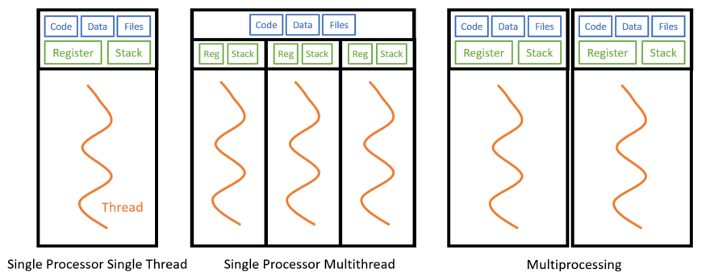
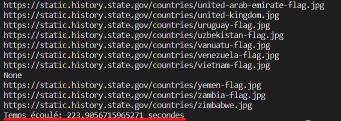
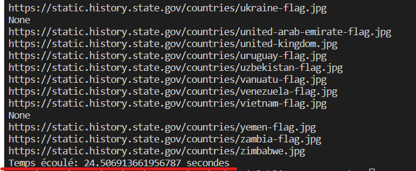
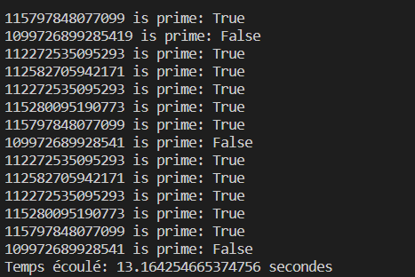
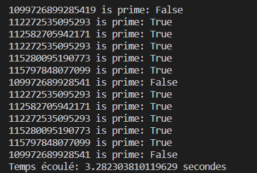

# Le multitasking en Python
## Qu’est-ce que le multitasking ?

Le multitasking c’est la capacité d’un système d’exploitation à effectuer plusieurs tâches simultanément. Par exemple, vous pouvez travailler sur vs code, téléchargez un film et écoutez de la musique. Toutes ces tâches sont effectuées par le même système d'exploitation.
En python on a deux types de multitasking:
1. Basé sur les processus (multiprocessing)
2. Basé sur des threads (multithreading)

## Multiprocessing vs Multithreading
Le multithreading est la capacité d'un processeur à executer plusieurs threads simultanément. Alors que le multiprocessing fait référence à la capacité d'un système à exécuter plusieurs processeurs simultanément, où chaque processeur peut exécuter un ou plusieurs threads. 



D'après la figure ci-dessus nous pouvons voir que le multithreading (diagramme du milieu), les threads partagent le même code, les mêmes données et les mêmes fichiers mais s'exécutent sur un registre et une pile différents. Le multiprocessing (diagramme de droite), le code, les données et les fichiers sont répliqués dans chaque processeur.

Le multithreading est utile pour les processus liés aux Entées/Sorties, tels que la lecture de fichiers à partir d'un réseau ou d'une base de données, car chaque thread peut exécuter simultanément le processus lié aux Entrées/Sorties. Le multiprrocessing est utile pour les processus liés au processeur, tels que les tâches lourdes en calcul, car il bénéficiera de plusieurs processeurs. 

## Multithreading et Multiprocessing en python:
En python beaucoup de possibilités nous sont en disposition pour l'implémentation du multithreading et du multiprocessing. Dans cet article nous allons voir comment les implémentés à l'aide des classes **ThreadPoolExecutor** (pour le multithreading) et **ProccesPoolExecutor** (pour le multiprocessing) du module **concurrent.futures** introduit en python *3.2*.

- ### Multithreading :
Pour mettre en illustration l'utilisation des threads nous allons essayer de recupérer les urls des images des pays se trouvant sur ce [lien](https://history.state.gov/countries/all).
En premier lieu nous allons les récupérés sans l'utilisation des threads:
```python
import re
import requests
from bs4 import BeautifulSoup
import time

BASE_URL = 'https://history.state.gov'

def fetch(url: str):
    with requests.Session() as session:
        data = session.get(url)
    return data.text

def extractImageUrl(a):
    lien = BASE_URL+a['href']
    data = BeautifulSoup(fetch(lien), features="html.parser")
    img_url = data.find(class_="tei-graphic")
    if img_url is not None:
        return img_url['src']
    else:
        return None

if __name__ == '__main__':
    debut = time.time()
    data = BeautifulSoup(
        fetch('https://history.state.gov/countries/all'),
        features="html.parser"
    )

    regex = re.compile('/countries/\w+')
    lista = data.find_all(href=regex)
    lista = lista[2:-1]

    for a in lista:
        print(extractImageUrl(a))
    
    fin = time.time()

    print(f"Temps écoulé: {fin-debut} secondes")
```
Résultat:

Comme le montre l'image ci-dessus notre programme a pris presque 224 secondes soit 3 minutes et quelques pour recupérer les url d'images des pays.
Maintenant ré-écrivonons ce programme cette fois ci avec l'utilisation des threads:
```python
import re
import requests
from bs4 import BeautifulSoup
import time
from concurrent.futures import ThreadPoolExecutor

BASE_URL = 'https://history.state.gov'

def fetch(url: str):
    with requests.Session() as session:
        data = session.get(url)
    return data.text

def extractImageUrl(a):
    lien = BASE_URL+a['href']
    data = BeautifulSoup(fetch(lien), features="html.parser")
    img_url = data.find(class_="tei-graphic")
    if img_url is not None:
        return img_url['src']
    else:
        return None

if __name__ == '__main__':
    debut = time.time()
    data = BeautifulSoup(
        fetch('https://history.state.gov/countries/all'),
        features="html.parser"
    )

    regex = re.compile('/countries/\w+')
    lista = data.find_all(href=regex)
    lista = lista[2:-1]

    with ThreadPoolExecutor() as executor:
        liste_urls = list(executor.map(extractImageUrl,lista))
        
    for url in liste_urls:
        print(url)

    fin = time.time()

    print(f"Temps écoulé: {fin-debut} secondes")

```
Résultat:


Waouhhh!!! nous constatons une différence énorme avec les threads il nous a fallu moins d'une minute (24 secondes) pour recupérer tous les urls d'images.

- ### Multiprocessing :
Comme on l'avait plus haut dans l'article le multiprocessing est utilisé pour les calculs lourds. Pour le mettre en illustration nous allons créer un programme pour savoir si un nombre est premier ou pas.
En premier lieu nous allons écrire le programme sans le multiprocessing:
```python
import math
import time

PRIMES = [
    112272535095293,
    112582705942171,
    112272535095293,
    115280095190773,
    115797848077099,
    1099726899285419,
    112272535095293,
    112582705942171,
    112272535095293,
    115280095190773,
    115797848077099,
    109972689928541,
    112272535095293,
    112582705942171,
    112272535095293,
    115280095190773,
    115797848077099,
    109972689928541]

def is_prime(n):
    if n < 2:
        return False
    if n == 2:
        return True
    if n % 2 == 0:
        return False

    sqrt_n = int(math.floor(math.sqrt(n)))
    for i in range(3, sqrt_n + 1, 2):
        if n % i == 0:
            return False
    return True

def main():
    debut = time.time()
    for number in PRIMES:
         print('%d is prime: %s' % (number, is_prime(number)))

    fin = time.time()
    print(f"Temps écoulé: {fin-debut} secondes")

if __name__ == '__main__':
    main()
```
Resultat:

L'execution de notre programme a pris 13 secondes, pas nombreux mais vous verrez qu'avec le multiprocessing ça sera plus rapide.
```python
import concurrent.futures
import math
import time

PRIMES = [
    112272535095293,
    112582705942171,
    112272535095293,
    115280095190773,
    115797848077099,
    1099726899285419,
    112272535095293,
    112582705942171,
    112272535095293,
    115280095190773,
    115797848077099,
    109972689928541,
    112272535095293,
    112582705942171,
    112272535095293,
    115280095190773,
    115797848077099,
    109972689928541]

def is_prime(n):
    if n < 2:
        return False
    if n == 2:
        return True
    if n % 2 == 0:
        return False

    sqrt_n = int(math.floor(math.sqrt(n)))
    for i in range(3, sqrt_n + 1, 2):
        if n % i == 0:
            return False
    return True

def main():
    debut = time.time()
    with concurrent.futures.ProcessPoolExecutor() as executor:
        for number, prime in zip(PRIMES, executor.map(is_prime, PRIMES)):
            print('%d is prime: %s' % (number, prime))
    fin = time.time()
    print(f"Temps écoulé: {fin-debut} secondes")

if __name__ == '__main__':
    main()
```
Résultat:

Ehh!!! bimmm!! l'éxecution n'a pris que 3 secondes, même si la différence n'est pas énorme mais elle pouvait être beaucoup plus conséquante si nous avions beaucoup plus de nombre dans la liste *'PRIMES'*

Comme vous avez pu le constater ils sont tous utilisés pour optimiser les performances d'une application ou d'un programme, mais chacun des deux ont des avantages comme des inconvénients ce qui fait que l'utilisation de l'un est plus adéquat que l'autre dans certains des cas.
Dans les tableaux ci-dessous nous représenterons respectivement les avantages et les inconvénients du multithreading et du multiprocessing.

| Avantages         | Incovénients     |
|--------------|-----------|
|**Partage des ressources**: Tous les threads d’un processus partagent ses ressources telles que la mémoire, les données, les fichiers, etc. Une seule application peut avoir différents threads dans le même espace d’adressage à l’aide du partage de ressources.| Les programmes multithreades ne s’exécutent pas rapidement si les systèmes informatiques ne sont pas dotés de plusieurs processeurs
|**Réactivité:** La réactivité du programme permet à un programme de s’exécuter même si une partie de celui-ci est bloquée à l’aide du multithreading.| Le partage des ressources conduit à une plus grande utilisation de la mémoire et du processeur.
|Ils ne nécessitent pas beaucoup de mémoire.| Le multithreading augmente la complexité du programme, ce qui rend également le débogage difficile.
|Un gain de temps.| L'exécution ne peut pas être interrompu.

| Avantages         | Incovénients     |
|--------------|-----------|
|Augmentation du débit − En augmentant le nombre de processeurs, plus de travail peut être effectué en une unité de temps.|Communication: Comme plusieurs processeurs communiquent entre eux, la mise en œuvre du système d’exploitation est complexe à gérer.|
|Réduction des coûts − Le système parallèle partage la mémoire, les bus, les périphériques, etc. Le système multiprocesseur permet ainsi d’économiser de l’argent par rapport à plusieurs systèmes uniques. En outre, si un certain nombre de programmes doivent fonctionner sur les mêmes données, il est moins coûteux de stocker ces données sur un seul disque et partagées par tous les processeurs au lieu d’utiliser de nombreuses copies des mêmes données.|Plus de mémoire requise : Comme il y a des multiprocesseurs qui fonctionnent les uns avec les autres, chaque processeur a besoin d’espace mémoire.|
|Fiabilité accrue − Dans ce système, car la charge de travail est répartie entre plusieurs processeurs, ce qui se traduit par une fiabilité accrue. Si un processeur tombe en panne, sa défaillance peut ralentir légèrement la vitesse du système, mais le système fonctionnera sans problème.|Impasse: Si un processeur utilise déjà le périphérique d’E/S, les autres processeurs ne peuvent pas utiliser le même périphérique d’E/S, ce qui crée un blocage.|
||Performance: Si un processeur ne fonctionne pas, le travail est divisé en d’autres processeurs. Le mauvais effet sera que le travail sera terminé à temps et que les performances du système seront affectées.|
||Cher: Ces types de systèmes sont coûteux à l’achat.|
